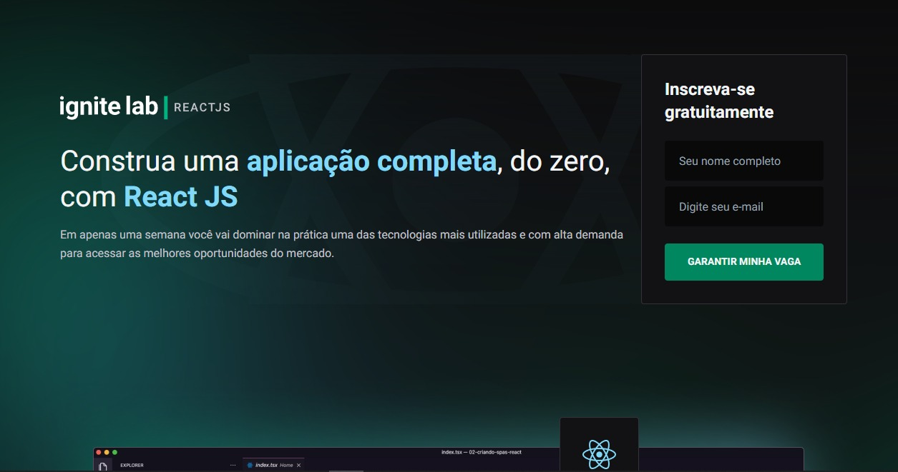
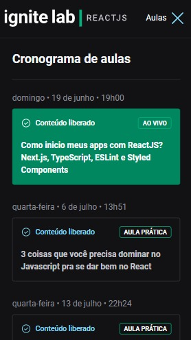
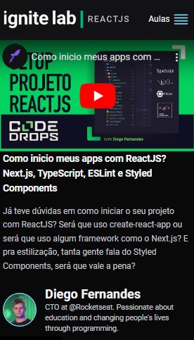

<h1 align="center">
  Ignite Lab
</h1>

<p align="center">
  <a href="#-projeto">Projeto</a>&nbsp;&nbsp;&nbsp;|&nbsp;&nbsp;&nbsp;
  <a href="#-tecnologias-utilizadas">Tecnologias Utilizadas</a>&nbsp;&nbsp;&nbsp;|&nbsp;&nbsp;&nbsp;
  <a href="#-como-executar">Como executar</a>&nbsp;&nbsp;&nbsp;|&nbsp;&nbsp;&nbsp;
  <a href="#-licença">Licença</a>
</p>

<p align="center">
  
  <br>
  <br>
  
  <br>
  <br>
  
  <br>
  <br>
  
</p>

## 💻 Projeto
Projeto de uma plataforma de um evento de especialização em front-end usando React.

## 🔖 Layout

Você pode visualizar o layout do projeto através [desse link](https://www.figma.com/file/nX530LSyJwdGt9C3cTJ3Sh/Plataforma-de-evento---Ignite-Lab-(Community)?node-id=0%3A1/duplicate). É necessário ter conta no [Figma](http://figma.com/) para acessá-lo.

## ✨ Tecnologias utilizadas

Esse projeto foi desenvolvido com as seguintes tecnologias:

- [React JS](https://pt-br.reactjs.org/)
- [Vite](https://vitejs.dev/)
- [Typescript](https://www.typescriptlang.org/)
- [GraphCMS](https://hygraph.com/)
- [GraphQL](https://graphql.org/)
- [Tailwind](https://tailwindcss.com/)

## 🚀 Como executar

- Você precisa instalar o [Vite](https://vitejs.dev/) e o [NodeJs](https://nodejs.org/en/) para executar este projeto.

**Clone o projeto**

```bash
  git clone https://github.com/kaicLimaOliveira/IgniteLab.git
```

**Siga os passo abaixo**

```bash
  #Utilize para instalar todas as dependências
  yarn

  #Para executar o projeto
  yarn dev

```

### Configuração cutomizada

Veja [Referência configuração](https://cli.vuejs.org/config/).

## 📄 Licença

Esse projeto está sob a licença MIT. Veja o arquivo [LICENSE](LICENSE) para mais detalhes.

---

<a href="https://kaicLimaOliveira.github.io">
 
 <br />
 <sub><b>Kaic de Lima Oliveira</b></sub></a>

Feito por Kaic de Lima Oliveira 👋🏽 Entre em contato!

[](https://www.facebook.com/kaic.oliveira.587) [](https://www.instagram.com/kaic.lo)
[](mailto:kaic10@outlook.com)
[](https://www.linkedin.com/in/kaic-de-lima-oliveira-3633041a4/)
